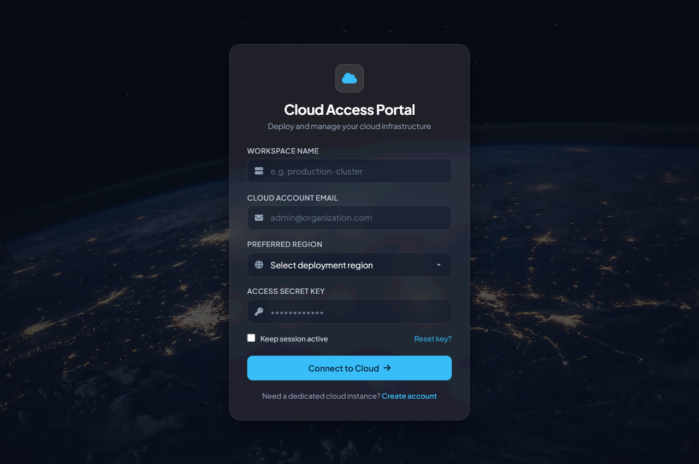

# Cloud Access Portal

A sleek, minimal cloud services portal interface featuring frosted glassmorphism, responsive inputs, and high-performance frontend architecture.

## 🚀 Features
- **Modern Minimal UI**: Glassmorphic card design with dark atmospheric cloud background.
- **Cloud Service Controls**:
  - Workspace selector
  - Account credentials & region dropdown
  - Persistent session management
- **Documentation & Assets**:
  - `index.html`: Fully self-contained HTML/CSS source
  - `hii_soham.docx`: Complete project documentation with code formatting
  - `screenshot.png`: High-resolution preview of the portal UI

## 📸 Preview

## 💻 Getting Started
Simply open `index.html` in any modern web browser.
